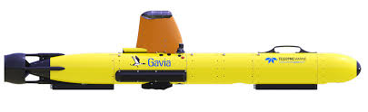
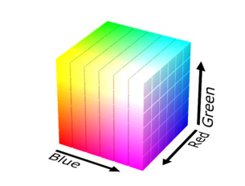
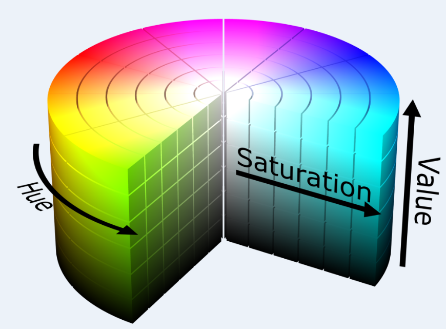
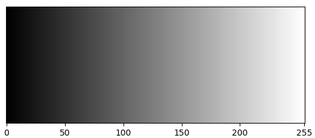

# Introduction to OpenCV

## Apa itu OpenCV?
OpenCV merupakan sebuah library yang bisa kita gunakan untuk melakukan pengolahan gambar, video, atau pengolahan dari kamera secara realtime. OpenCV bersifat open-source, dan bisa digunakan untuk mengolah citra yang dikonversi dari analog ke digital sehingga kita bisa melakukan operasi-operasi pengolahan citra. Pemrosesan gambar bisa membantu kita untuk melakukan perbaikan kualitas gambar, menghilangkan noise, identifikasi gambar, deteksi warna, dan lain-lain.

## Instalasi

### Windows
1. Download dan Install Anaconda Kamu dapat mengunjungi website anaconda
2. Pilih versi 64-bit
3. Ikuti proses instalasi dan pastikan checklist "Add Anaconda3 to my PATH environment variable"
4. Membuat environtment baru
```bash
conda create --name opencv-env
```
5. Mengaktifkan environment
```bash
conda activate opencv-env
```
6. Install opencv pada environment yang telah dibuat
```bash
conda install -c conda-forge opencv
```
7. Periksa Instalasi opencv
```python
import cv2 as cv
cv.__version__
```

### Ubuntu (Linux)

Untuk OpenCV versi python bisa langsung diinstall memakai package manager apt, seperti berikut:
```bash
sudo apt install python3-opencv -y
```

## Konsep

### Import Lib
Sebelum melakukan operasi menggunakan opencv pastikan pada baris awal telah mengimpor library:
```python
import cv2 as cv
# Mengimpor OpenCV
import numpy as np
# Mengimpor NumPy
```

## 01 - Reading Images, Video, Webcam

### a. Membaca Images
Pembacaan suatu gambar dilakukan dengan fungsi `imread()`.
```python
import cv2 as cv

img = cv.imread("images/coba.jpg") # read path

print('Tipe data gambar  :', type(img))
print('Shape gambar      :', img.shape)

cv.imshow("Gambar Asli", img) # display image
cv.waitKey(0) # prevent to close or wait for a keystroke
cv.destroyAllWindows() # destroy all windows created
```


### b. Video di OpenCV
Kita bisa memakai `VideoCapture()` untuk melakukan pengambilan frame dari video/camera.
```python
import cv2 as cv

# load video by path
cap = cv.VideoCapture("images/video.mp4")

# loop for video
while True:
    isTrue, frame = cap.read() # read by frame
    if not isTrue:
        break
        
    cv.imshow("Name Video", frame)

    if cv.waitKey(20) & 0xFF == ord('q'): # stop video
        break

cap.release() # post
cv.destroyAllWindows() # destroy
```

### c. Webcam
```python
webcam = cv.VideoCapture(0) # 0 for main webcam ur first device

while True:
    ret, frame = webcam.read()
    cv.imshow('Hasil Filter Video', frame)

    if cv.waitKey(20) == ord('q'):
        break

webcam.release()
cv.destroyAllWindows()
```


## 02 - Resizing dan Rescaling Frames

Resizing dan rescaling digunakan untuk mengubah ukuran gambar atau video. 
Biasanya dipakai untuk mempercepat proses komputasi, mengurangi penggunaan memori, dan menyesuaikan ukuran input model AI.
- **Resizing**: Mengubah ukuran ke dimensi tertentu
- **Rescaling**: Mengubah ukuran berdasarkan skala

```python
# Resizing
resize = cv.resize(img, (400, 300))

# Rescaling
def rescaleFrame(frame, scale=0.5):
    width = int(frame.shape[1] * scale)
    height = int(frame.shape[0] * scale)
    dimensions = (width, height)
    return cv.resize(frame, dimensions, interpolation=cv.INTER_AREA)

rescaled = rescaleFrame(img, 0.5)
```


## 03 - Drawing Shapes dan Putting Text

Koordinat pada OpenCV selalu menggunakan format `(x, y)` di mana `x` adalah posisi horizontal dan `y` adalah posisi vertikal.

### a. Menggambar Garis
```python
# cv.line(gambar, titik_awal, titik_akhir, warna_BGR, ketebalan)
cv.line(kanvas, (0,0), (700,500), (0,255,0), 3)
```

### b. Menggambar Persegi Panjang
```python
# cv.rectangle(gambar, titik_awal, titik_akhir, warna_BGR, ketebalan)
cv.rectangle(kanvas, (300,200), (400,300), (255, 0, 0), 3)
```

### c. Menggambar Lingkaran
```python
# cv.circle(gambar, titik_awal, Radius, warna_BGR, ketebalan)
cv.circle(kanvas, (600, 100), 70, (0, 255, 255), 4)
```

### d. Menambahkan Teks
```python
# cv.putText(gambar, teks, posisi_kiri_bawah, font, ukuran_font, warna, ketebalan)
cv.putText(kanvas, 'OpenCV Drawing!', (50, 470), cv.FONT_HERSHEY_SIMPLEX, 1.2, (255, 255, 255), 2)
```


## 04 - Filterisasi Fungsi Esensial dalam OpenCV

### a. cvtColor - Konversi Warna (Color Spaces)

#### BGR (RGB Color Space)
Pada OpenCV format color yang digunakan adalah format BGR. Dimana format tersebut diset default yang digunakan oleh OpenCV untuk membaca dan menulis gambar. 


#### HSV (HSV Color Space)
Berbeda dengan Color space lainnya, HSV hanya menggunakan satu channel (Hue) untuk mendeskripsikan warna dan channel lainnya menggunakan warna.


#### Grayscale (Grayscale Color Space)
Grayscale memperhitungkan semua aspek gambar dalam satu channel.


```python
img_gray = cv.cvtColor(img, cv.COLOR_BGR2GRAY)
img_rgb = cv.cvtColor(img, cv.COLOR_BGR2RGB)
img_hsv = cv.cvtColor(img, cv.COLOR_BGR2HSV)
```

### b. GaussianBlur - Fungsi Blur gambar
Berfungsi untuk menghaluskan (blur) gambar dan mengurangi noise menggunakan metode Gaussian Filter.
```python
# cv.GaussianBlur(gambar, ukuran_kernel, sigmaX)
img_blur = cv.GaussianBlur(img, (7, 7), 0)
```

### c. Crop - Memotong Gambar
```python
img_crop = img[100:200, 0:1]
# Memotong gambar menggunakan slicing NumPy: [baris_mulai:baris_akhir, kolom_mulai:kolom_akhir]
```


## 05 - Image Transformations

### a. Translasi
```python
tx = 100
ty = 50
matrix_translate = np.float32([[1, 0, tx], [0, 1, ty]])
translated = cv.warpAffine(img, matrix_translate, (img.shape[1], img.shape[0]))
```

### b. Rotasi Gambar
```python
center = (img.shape[1] // 2, img.shape[0] // 2)
matrix_rotate = cv.getRotationMatrix2D(center, 45, 1.0)
rotated = cv.warpAffine(img, matrix_rotate, (img.shape[1], img.shape[0]))
```

### c. Flip Gambar
```python
flip_horizontal = cv.flip(img, 1)
flip_vertical = cv.flip(img, 0)
flip_both = cv.flip(img, -1)
```

## Color Detection
Dalam melakukan deteksi warna di image, biasanya color space yang digunakan yaitu HSV. Berikut adalah contoh program untuk deteksi warna sekitar hue 150:

```python
import cv2 as cv
import numpy as np

# Pastikan "frame" sudah ada (misal dari cap.read())
framehsv = cv.cvtColor(frame, cv.COLOR_BGR2HSV)

hue = 150
thresh = 40

# Menentukan batas bawah dan atas warna HSV
minHSV = np.array([hue - thresh, 50, 50])
maxHSV = np.array([hue + thresh, 255, 255])

# Membuat mask dan menerapkan bitwise_and
maskHSV = cv.inRange(framehsv, minHSV, maxHSV)
resultHSV = cv.bitwise_and(frame, frame, mask=maskHSV)

cv.imshow("Result of HSV:", resultHSV)
```

## Compile Code
Untuk menjalankan script Python yang telah dibuat:
```bash
conda env list # looking for ur env list
conda activate <your environment which was installed openCV > # activate your existing env

python3 <your name file.py >
```

🚀 Selamat belajar! Week berikutnya kita akan mulai eksplorasi Introduction to CNN!

## References
- Operasi Basic: https://docs.opencv.org/3.4/d3/df2/tutorial_py_basic_ops.html
- Operasi Aritmetik: https://docs.opencv.org/3.4/d0/d86/tutorial_py_image_arithmetics.html

Akhirnya, kita telah mengulik dalam-dalam tentang OpenCV dan implementasinya.
